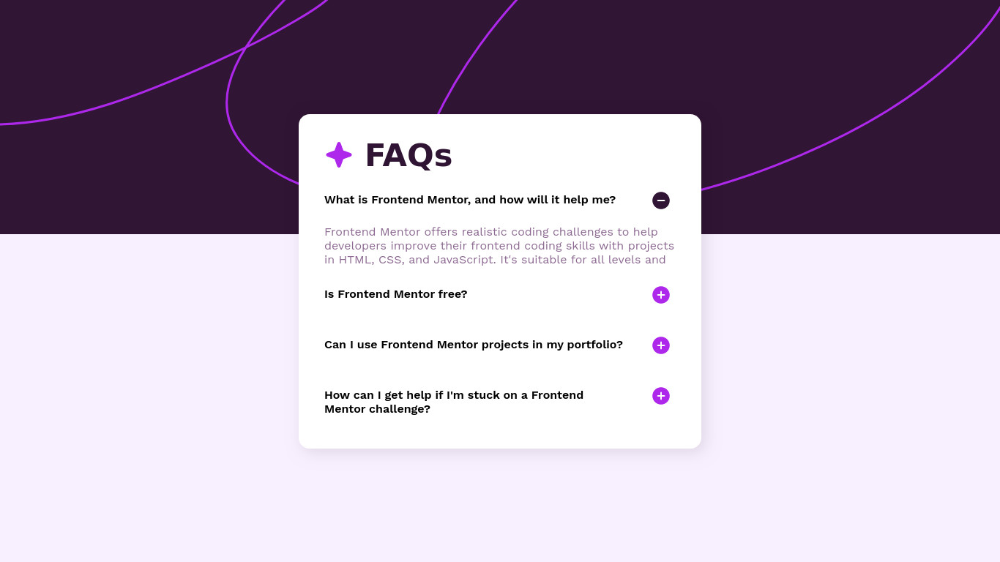

# Frontend Mentor - FAQ accordion solution

This is a solution to the [FAQ accordion challenge on Frontend Mentor](https://www.frontendmentor.io/challenges/faq-accordion-wyfFdeBwBz).

### Screenshot

### Links

- Live Site URL: [https://iambraga.github.io/faq-accordion/](https://iambraga.github.io/faq-accordion/)

## My process

### Built with

- Semantic HTML5 markup
- CSS properties
- CSS variables
- Flexbox

## Author

- Website - [Eduardo Braga](https://github.com/iambraga)
- Frontend Mentor - [@iambraga](https://www.frontendmentor.io/profile/iambraga)
